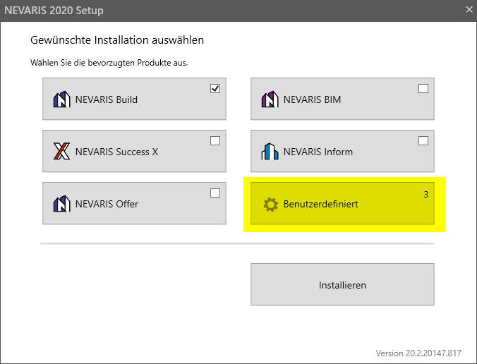
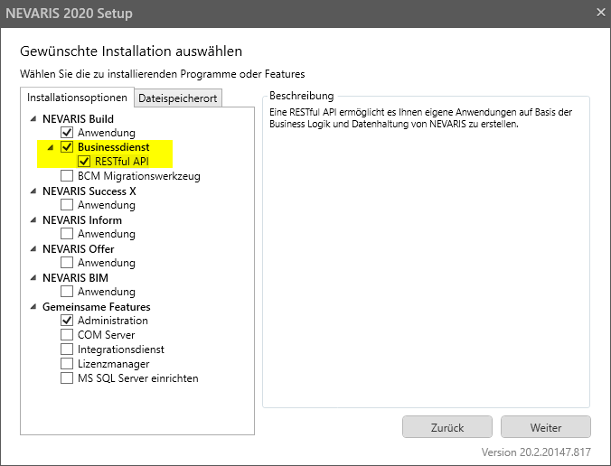
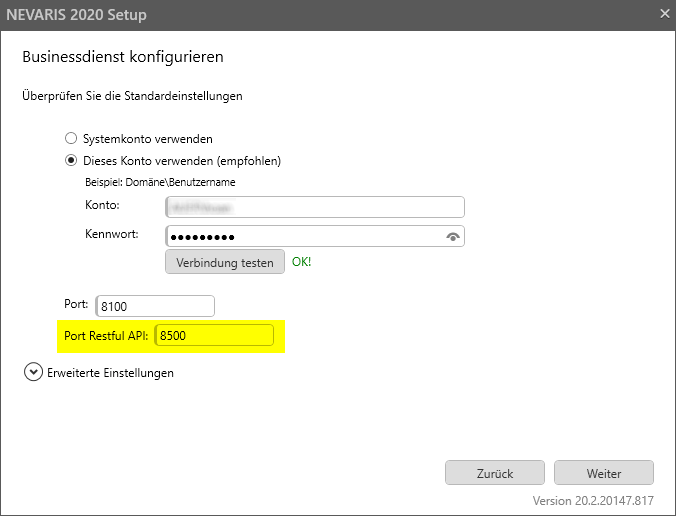
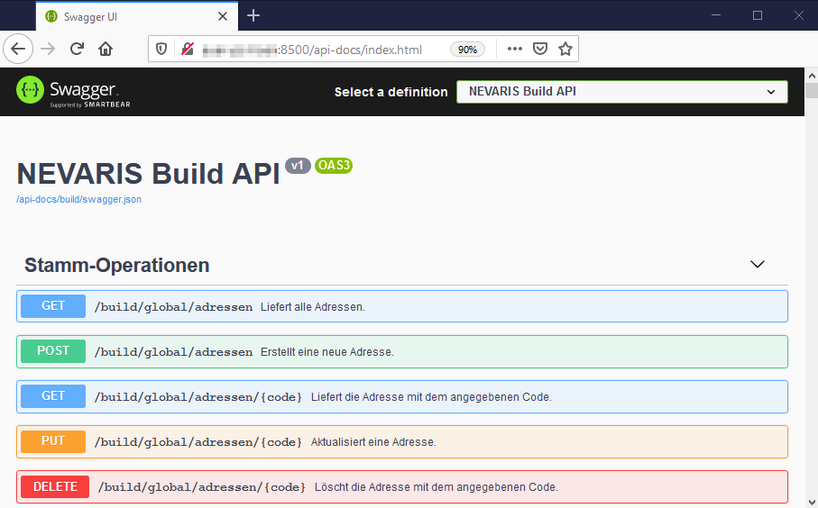

# http-api-client-libs für NEVARIS Build 2023.0

## Nevaris.Build.ClientApi 4.2.5

Diese .NET-Bibliothek ermöglicht einen typsicheren Zugriff auf die RESTful API
von NEVARIS Build 2023.0 Sie ist auch als
[nuget-Paket](https://www.nuget.org/packages/Nevaris.Build.ClientApi/) verfügbar.

## Neuerungen und Breaking Changes ##

### 4.2.5 (für Build 23.0 Patch 3)

- Feld _AlternativeNummer_ für die Betriebsmitteltypen Lohn, Gerrät und sonstige Kosten (in den
Klassen _BetriebsmittelLohnDetails_, _BetriebsmittelGerätDetails_ und _BetriebsmittelSonstigeKostenDetails_).
- Die Funktion _GetAllBetriebsmittel_ (enthalten sowohl in _IStammApi_ als auch _IProjektApi_) verhält sich nun
etwas anders bei Übergabe von _mitDetails = false_. Bislang führte dieses Argument dazu, dass die
betriebsmittelspezifischen Detailfelder (z.B. _Betriebsmittel.LohnDetails_ für Lohn) in den zurückgegebenen
Objekten ungleich null waren, die darin enthaltenen Objekten selbst jedoch nur unvollständig befüllt waren. Das war
ein Fehlverhalten, das zum Rücksetzen von Werten führen konnte, wenn das zurückgegebene Objekte anschließend
an _IStammApi.UpdateBetriebsmittel_ (bzw. _IProjektApi.UpdateBetriebsmittel_) übergeben wurde. Ab Version 4.2.5 werden die Detailfelder
im Fall _mitDetails = false_ die Detailfelder daher nicht mehr befüllt. Allerdings wurde der Defaultwert für den Parameter
_mitDetails_ von false auf true geändert, da das Auslesen der Detailinformationen üblicherweise erwünscht ist
und zudem hinsichtlich der Performance keine großen Nachteile mit sich bringt. Die meisten Client-Applikationen
dürften ohenhin bislang immer explizit _mitDetails = true_ übergeben haben, womit diese Änderung keine
erkannbaren Auswirkungen hat.

### 4.2.4 (für Build 23.0.22320.690)

- Unterstützung für Zahlungsbedingungen. Das Leistungsverzeichnis (abrufbar über _IProjektApi.GetLeistungsverzeichnis_)
erlaubt nun über die Property _LvDetails_ den Zugriff (lesend und schreibend) auf die Zahlungsbedingungen
 (Properties :_ZahlungsbedingungLV_, _ZahlungsbedingungAbschlagsrechnung_, _ZahlungsbedingungSchlussrechnung_).
Analog dazu gibt es für Rechnungen die neu hinzugekommene Property _Rechnung.Zahlungsbedingung_. 

### 4.2.3 (für Build 23.0.22293.484)

- Der Zugriff auf sonstige Eigenschaften von Materialien (abrufbar z.B. über _IStammApi.GetAllBetriebsmittel_) ist jetzt über die Property _BetriebsmittelMaterialDetails.Sonstiges_ möglich.
- Die Funktion _IStammApi.UpdateBetriebsmittelKostenCollection_ zum Aktualisieren mehrerer Betriebsmittel erlaubt jetzt auch die
Übergabe von weiteren Kosten (Ansatzzeilen).

### 4.2.0 (für Build 23.0.22280.498)

- Unterstützung für Individualeigenschaften: Mehrere Klassen haben jetzt eine Property _CustomPropertyValues_, die
den Zugriff auf Individualeigenschaften erlauben. Die Definition von Individualeigenschaften muss weiterhin über
den Administrationsbereich von Build erfolgen, die API erlaubt aber den Zugriff auf die Werte.

### 4.0.0

Im Vergleich zur Version 2.x (für Build 2022.1) gibt es ab Version 4.0.0
nun die Möglichkeit, Leistungsverzeichnisse über die API zu erstellen und zu manipulieren
(Erzeugen, Ändern und Löschen von Positionen und Knoten). Die relevanten
Funktionen sind:

- _IProjektApi.GetLeistungsverzeichnisse_
- _IProjektApi.GetLeistungsverzeichnis_
- _IProjektApi.GetLvKnoten_
- _IProjektApi.GetLvPosition_

sowie die zugehörigen Update- und Delete-Funktionen.

Beim Auslesen eines Leistungsverzeichnisses per _IProjektApi.GetLeistungsverzeichnis_
hat sich der Aufbau der zurückgegebenen Objekte leicht geändert, daher sind hier
eventuell Anpassungen an bestehenden Client-Applikationen vorzunehmen.

## Beispielcode ##

### Minimale Client-Applikation ###

Die Verwendung der Library lässt sich am besten anhand eines einfachen Clients
demonstrieren (zum Erstellen ist die Einbindung des  [nuget-Pakets](https://www.nuget.org/packages/Nevaris.Build.ClientApi/)
erforderlich):

```C#
using Nevaris.Build.ClientApi;

// Verbindung zum Businessdienst herstellen
using var nevarisBuildClient = new NevarisBuildClient(hostUrl: "http://localhost:8500");

// Build- und API-Version auslesen
var versionInfo = await nevarisBuildClient.StammApi.GetVersion();
Console.WriteLine($"Build-Version: {versionInfo.ProgramVersion}, API-Version: {versionInfo.ApiVersion}");

// Speicherorte auslesen
var speicherorte = await nevarisBuildClient.StammApi.GetSpeicherorte();
foreach (var speicherort in speicherorte)
{
    Console.WriteLine($"{speicherort.Id}: {speicherort.Bezeichnung}");
}
```

### http-api-demo-clients ###

Eine Solution mit komplexeren Client-Applikationen steht in einem eigenen git-Repository zur Verfügung: [http-api-demo-clients](https://github.com/NEVARISBausoftwareGmbH/http-api-demo-clients).

## Voraussetzungen ##

Um die RESTful API von NEVARIS Build nutzen zu können, muss auf einem geeigneten Server
der NEVARIS Businessdienst installiert werden. Dazu muss das Setup.exe per

_setup.exe /hiddenfeatures restfulapi_

gestartet werden und dann _Benutzerdefiniert_ ausgewählt werden:



und anschließend in der Installationsauswahl _Businessdienst_ und _RESTful API_ angehakt werden:



Der Port, über den die RESTful API erreichbar ist, ist konfigurierbar (der Standardwert ist 8500):



Die im Setup getätigten Einstellungen führen dazu, dass in der Nevaris.config
dieser Eintrag erzeugt wird, der den Businessdienst dazu veranlasst, die RESTful API 
am Port 8500 bereitzustellen:

````xml
<RestfulApiBaseAddress>http://*:8500</RestfulApiBaseAddress>
````

Nach erfolgreicher Installation wird der Dienstprozess _NEVARIS Build Businessdienst_ gestartet. Dieser stellt
die RESTful API sowie eine HTML-basierte Dokumentation bereit, die über die
URL **http://\<servername\>:8500/api-docs** erreichbar ist (falls 8500 als Portnummer gewählt wurde):



Die Doku enthält auch einen Link auf eine swagger.json-Datei, die eine formale Beschreibung der API enthält.
Daraus lässt sich mit geeigneten Tools auch automatisiert ein Client-Proxy erzeugen, falls dies erwünscht ist.
